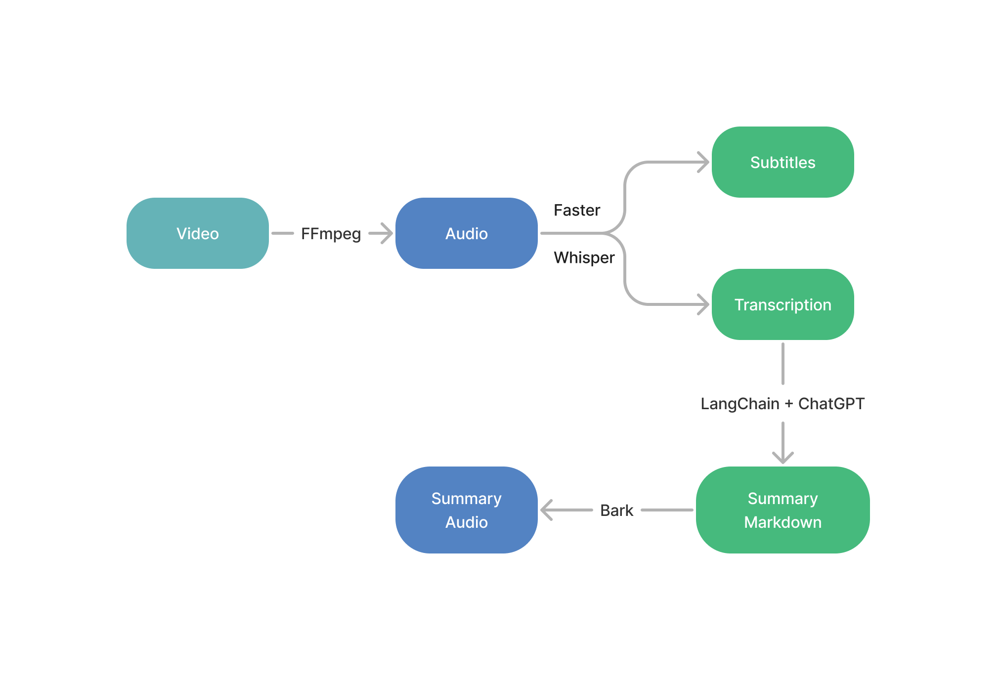

## Video to SRT Subtitle Converter

This Python script converts video files to SRT subtitle files using the Faster-Whisper model for speech recognition. The script reads video files from an input folder, converts them to MP3 format using ffmpeg, transcribes the audio using the Faster-Whisper model, and generates an SRT subtitle file for each video file in the output folder.



### Requirements

To run this script, you will need:

- Python 3.7 or higher
- The dependencies listed in `requirements.txt`
- ffmpeg

To install the required Python libraries, you can use pip:

```
pip install -r requirements.txt
```

To install ffmpeg, you can download a pre-built binary from the official website:

- [FFmpeg Downloads ↗](https://www.ffmpeg.org/download.html)

If you plan to run the script on a GPU, you will also need the NVIDIA libraries cuBLAS 11.x and cuDNN 8.x installed on your system. Please refer to the CTranslate2 documentation for installation instructions.

### Usage

1. Configure the input and output folder paths in the `config.ini` file.
2. Run the script using the following command:

```
python main.py
```

The script will iterate over all video files in the input folder, convert them to MP3 format using ffmpeg, transcribe the audio using the Faster-Whisper model, and generate an SRT subtitle file for each video file in the output folder.

### Config

The script uses a configuration file `config.ini` to set the input and output folder paths, as well as the model configuration parameters. The file contains two sections: `[PATHS]` and `[MODEL]`.

#### PATHS

The `[PATHS]` section contains the following options:

- `input_folder`: the path to the folder containing the video files to be converted. Default is `/path/to/input/folder`.
- `output_folder`: the path to the folder where the SRT subtitle files will be saved. Default is `/path/to/output/folder`.

#### MODEL

The `[MODEL]` section contains the following options:

- `model_size`: the size of the Faster-Whisper model to use for speech recognition. Default is `large-v2`.
- `device`: the device to run the model on. Default is `cuda`.
- `compute_type`: the compute type to use for the model. Default is `float16`.

To modify the configuration, open `config.ini` in a text editor and change the values of the options as desired. Make sure to save the file before running the script.

Note: The `[MODEL]` section determines the performance and accuracy of the speech recognition, and may affect the speed and memory usage of the script. If you experience performance issues, consider modifying the model size or compute type.

### License

This script is released under the MIT License.